# SynchronAIse - Architecture & File Tree Plan

Greenfield build. Workspace currently holds only the roadmap PDFs in `docs/`. Target: **Graph Reconciliation Studio** frontend + **Python/FastAPI** backend, split across a **tool repo** and a **demo repo** (the Action must live in one repo and trigger on PRs in the other).

## 1. Guiding principles (from the roadmap)

- **Pipeline first, Studio second, taste above all.** Steps 1-4 (Action -> render -> audit -> comment) are the product; the Studio is the demo amplifier and is layered/cuttable.
- **JSON contract is frozen at H+1** and drives everything: PR comment, Studio, metrics. Every role codes against a mock so nobody waits on R1's real LLM.
- **Frozen scope:** ONE Studio screen per audit, read-only graphs, prompt-fixes generate a patch (never auto-commit). No auth, nav, multi-repo.

## 2. Overall architecture

Five components map cleanly to the five roles:

- **Demo repo (R2)** - the `StatusCard` hero component, ~20 design tokens, and 6 drift PRs. This is the repo judges browse and where the Action fires.
- **GitHub Action (R4)** - critical path. On push/PR: Playwright renders the changed component -> PNG snapshot -> `POST /audit` -> posts a PR comment (findings + `cursor_patch` as a GitHub suggestion + Studio link) -> updates the same comment on re-push.
- **Audit service (R3, FastAPI)** - `POST /audit` orchestrates the VLM, builds `design_tree` + `code_tree`, stores each result by `audit_id`; `GET /report/{id}` serves the stored payload to the Studio.
- **AI/Taste Engine (R1)** - lives inside the backend: the classification prompt + few-shot examples + validated Pydantic schema that produces the frozen JSON contract (Noise vs Violation vs Evolution).
- **Graph Reconciliation Studio (R5, React + react-flow)** - a pure renderer of the stored JSON: two graphs side by side, nodes colored by classification, click -> explanation panel, prompt box -> generated patch.

```mermaid
flowchart LR
    Dev["Developer push"] --> DemoRepo["Demo repo PR (StatusCard drift)"]
    DemoRepo --> Action["GitHub Action (R4)"]
    subgraph actionSteps [Action steps]
        Render["Playwright render + snapshot"] --> CallAudit["POST /audit"]
        CallAudit --> Comment["Post/Update PR comment"]
    end
    Action --> Render
    CallAudit --> Backend["FastAPI audit service (R3)"]
    subgraph backendInternals [Backend]
        TreeBuild["Build design_tree + code_tree"] --> Engine["Taste Engine / VLM (R1)"]
        Engine --> Store["Store audit by audit_id"]
    end
    Backend --> TreeBuild
    Store --> ContractJSON["Frozen JSON contract"]
    ContractJSON --> Comment
    Comment --> PR["PR comment: reasoning + cursor_patch + Studio link"]
    Studio["Graph Reconciliation Studio (R5)"] -->|"GET /report/{id}"| Backend
    PR -->|"Studio link"| Studio
    Studio --> Fix["Prompt box / Cursor fix -> patch"]
    Fix --> Dev
```



Full loop: **push -> snapshot -> classification -> feedback -> fix in Cursor -> green.**

## 3. The JSON contract (the spine)

One Pydantic model (backend) + one TS type (frontend) mirror the frozen payload: `audit_id`, `pr_number`, `drift_score`, `screenshot_url`, `design_tree`, `code_tree`, `findings[]` (with `node_id`, `classification`, `bbox`, `expected`/`actual`, `reasoning`, `cursor_patch`), `ignored_as_noise[]`, `evolution_proposals[]`. `node_id` links a finding to a graph node and drives coloring. A committed `contract.example.json` + `audit_mock.json` are the source of truth all roles build against from hour one.

## 4. Proposed file tree

### Tool repo - `synchronaise/` (monorepo)

```text
synchronaise/
  docs/                          # existing roadmap PDFs + README assets
  packages/
    contract/
      schema.json                # JSON Schema of the frozen contract
      contract.example.json      # canonical example payload
      README.md
  backend/                       # R3 + R1
    app/
      main.py                    # FastAPI app + CORS + routes
      api/
        audit.py                 # POST /audit
        report.py                # GET /report/{id}
        fix.py                   # POST /fix  (prompt box -> patch)
      core/
        config.py                # env, API keys (Gemini + fallback)
        schema.py                # Pydantic models = JSON contract
      services/
        vlm.py                   # VLM orchestration + provider fallback + retry
        classifier.py            # runs the Taste Engine prompt, validates JSON
        tree_builder.py          # assemble design_tree + code_tree
        code_parser.py           # TSX -> AST node tree (stable node ids)
        figma_parser.py          # Figma intent -> tree (hardcoded for demo)
        patch.py                 # build cursor_patch + prompt-driven fix
        storage.py               # save/load audits by audit_id (JSON/SQLite)
      prompts/
        classification.md        # R1 prompt + few-shot (Noise/Violation/Evolution)
      data/
        tokens.json              # ~20 design tokens (shared reference)
    mocks/
      audit_mock.json            # hour-one hardcoded contract
    tests/
      test_contract.py           # schema validation
      test_classifier.py         # accuracy over the 6 golden cases
    requirements.txt
    .env.example
    Dockerfile
  frontend/                      # R5 - Graph Reconciliation Studio
    src/
      main.tsx
      App.tsx                    # single Studio screen
      api/client.ts              # GET /report/{id}, POST /fix
      types/contract.ts          # mirrors JSON contract
      lib/layout.ts              # dagre auto-layout for react-flow
      components/
        Studio.tsx
        GraphView.tsx            # dual react-flow graphs + mapping edges
        TreeNode.tsx             # node colored by classification
        ExplanationPanel.tsx     # expected vs actual + reasoning + patch
        PromptBox.tsx            # NL prompt -> generated patch
        DriftScore.tsx
      mocks/audit.json           # same payload as backend mock
    index.html
    package.json
    vite.config.ts
  action/                        # R4 - reusable composite action
    action.yml                   # push/PR -> render -> audit -> comment
    scripts/
      render.mjs                 # Playwright render changed component -> PNG
      audit.mjs                  # POST snapshot+code+tokens to /audit
      comment.mjs                # create/update PR comment (suggestion block)
      changed-files.mjs          # audit only changed files
    playwright.config.ts
  README.md                      # architecture + run + "built during the event"
  LICENSE
```

### Demo repo - `synchronaise-demo/` (separate repo, R2)

```text
synchronaise-demo/
  src/
    tokens.css                   # ~20 tokens as CSS vars
    tokens.json                  # machine-readable mirror
    components/
      StatusCard.tsx             # hero component (default/warning/danger)
    render/
      status-card-entry.tsx      # standalone CI render target
  ground-truth/
    pr-1.json ... pr-6.json      # expected class + violation + bbox per case
  .github/workflows/
    audit.yml                    # uses synchronaise/action on PRs
  package.json
  README.md                      # the 6 drift cases as open PRs
```

## 5. Build order (mirrors the timeline)

1. **H+1 - freeze the contract:** write `packages/contract/contract.example.json` + `schema.json`; copy into `backend/mocks/audit_mock.json` and `frontend/src/mocks/audit.json`.
2. **Walking skeletons in parallel:** R4 ships an Action posting a hardcoded comment (proves permissions); R3 serves `GET /report/{id}` from the mock; R5 renders the Studio from the frontend mock; R1 sets up VLM access; R2 builds `StatusCard` + tokens.
3. **Core loop (-> 7PM checkpoint):** real Playwright render -> real `/audit` -> real formatted comment on PR #1; R1's prompt stable over 3 runs; R2 delivers PRs 1-3.
4. **Extend:** PRs 4-6, comment-update-on-repush, Studio renders a real stored audit with node coloring + explanation panel.
5. **Harden (Sun):** E2E all 6 PRs x2, latency < 60s, wire prompt box -> `/fix`, green resolved state, measure real metrics for the README/pitch.

Layered cut order if time runs out: prompt box -> whole Studio -> PR #6 -> PR #5 -> comment-update-on-repush. The PR comment alone can always carry the demo.