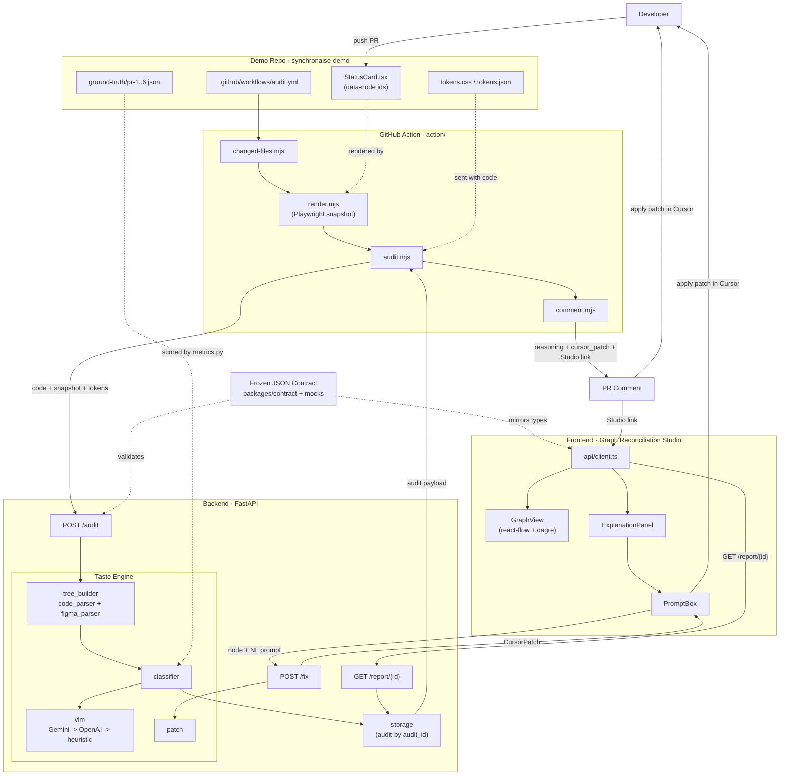

# SynchronAIse

**A CI/CD-native design auditor with a Graph Reconciliation Studio.**

On every pull request, a GitHub Action renders the changed component, the AI
engine builds and compares two graphs (Figma intent vs code AST), classifies
every deviation, and the developer gets instant feedback: a PR comment with a
Cursor-ready patch, plus a link to the Studio where the drift is visible,
explainable, and fixable by prompt.

> The full loop: **push → snapshot → classification → feedback → fix in Cursor → green.**

## The Taste Engine - what makes us different

Every detected difference is triaged into three classes. Getting the middle one
right - ignoring technical noise *with visible reasoning* - is the judged
"taste" and the core of the project.

| Class | Meaning | Color |
| --- | --- | --- |
| `design_violation` | A real break from the design system (flag + patch). | red |
| `technical_noise` | No visual/semantic impact - ignored on purpose. | grey |
| `intentional_evolution` | New intent - reconcile, don't roll back. | amber |

## Architecture

New to the project? Start with the **[team building-blocks guide](docs/building-blocks.md)** -
it explains every block in plain language (including what the JSON contract is and
exactly how the GitHub Action integration works). For the diagram and interactions,
see [`docs/architecture.md`](docs/architecture.md).



Five components, mapped to the five roles:

| Path | Role | What it is |
| --- | --- | --- |
| [`packages/contract`](packages/contract) | all | The frozen JSON contract that drives everything. |
| [`backend`](backend) | R3 + R1 | FastAPI audit service + the Taste Engine. |
| [`action`](action) | R4 | The reusable GitHub Action (render → audit → comment). |
| [`frontend`](frontend) | R5 | The Graph Reconciliation Studio (React + react-flow). |
| [`synchronaise-demo`](synchronaise-demo) | R2 | Hero `StatusCard`, tokens, and the 6 drift PRs. |

## Run instructions

### Backend (audit service)

```bash
cd backend
python -m venv .venv && . .venv/Scripts/activate   # Windows: .venv\Scripts\activate
pip install -r requirements.txt
cp .env.example .env            # add GEMINI_API_KEY / OPENAI_API_KEY, or leave blank for MOCK_MODE
uvicorn app.main:app --reload   # http://localhost:8000  (/healthz, /docs)
```

Without API keys the service runs the deterministic heuristic Taste Engine - the
whole loop still works, offline.

### Frontend (Studio)

```bash
cd frontend
npm install
npm run dev                     # http://localhost:5173  (opens the demo audit)
```

Open a specific audit at `http://localhost:5173/#/report/<audit_id>`.

### Demo repo + Action

See [`synchronaise-demo/README.md`](synchronaise-demo/README.md). Point the
demo repo's workflow at this repo's `action/`, and set `AUDIT_API_URL` +
`STUDIO_BASE_URL` in repo secrets/variables.

## Tests & metrics

```bash
cd backend
pytest                      # contract + Taste Engine over the 6 golden cases
python scripts/metrics.py   # the REAL numbers used in the pitch
python scripts/validate_contract.py packages/contract/contract.example.json
```

## Built during the event

Everything in this repository was built during **RAISE Hackathon 2026 (Cursor
Track)**. Strategic order was non-negotiable: the pipeline (render → audit →
comment) is the product and was built first; the Studio is the demo amplifier,
layered on top. No API keys are committed - see `backend/.env.example`.

Roadmap (post-hackathon): QA Lens, bidirectional sync, dynamic Figma scraper,
editable graphs.

## License

[MIT](LICENSE).
