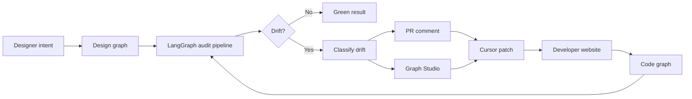
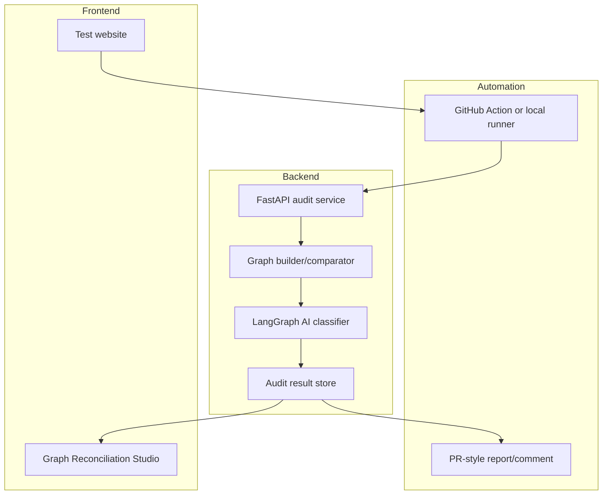

# SynchronAIse

SynchronAIse is a design-to-code drift auditor built for the RAISE Hackathon 2026 Cursor Track.

The goal is to help teams detect when a shipped website no longer matches the intended design. Designers should be able to connect agents to a website, inspect mismatches, and request improvements directly. Developers should be able to run a graph-based audit that compares design intent against the implemented system and returns actionable feedback, ideally inside the GitHub pull request and Cursor workflow.

Submission deadline: Sunday, July 5th, 12:00 PM.  
Internal target: finish the demo-critical system by Sunday 9:30 AM, then use the remaining time only for hardening, recording, and submission.

## Product In One Sentence

SynchronAIse turns a designer's intended UI and a developer's implemented UI into comparable graphs, detects meaningful differences, classifies those differences with AI, and returns a fix path through PR comments, a graph studio, and Cursor-compatible patches.

## Stakeholders

### Designers

Designers use SynchronAIse to review a live or test website against the design intent. The system should make drift visible, explain why it matters, and help generate safe changes.

Designer workflow:

1. Open the test website or Graph Reconciliation Studio.
2. Review highlighted drift between the intended design and the implemented website.
3. Click a drift node to see expected value, actual value, severity, and reasoning.
4. Ask the agent to suggest a design-safe correction.
5. Hand the generated patch or instruction to the developer workflow.

### Developers

Developers use SynchronAIse inside the Git workflow. On every relevant push or PR update, the system renders the changed UI, builds a graph for the implementation, compares it to the design graph, and comments with findings.

Developer workflow:

1. Push code to a PR.
2. GitHub Action renders the affected component or page.
3. Backend audit service receives the snapshot and graph inputs.
4. LangGraph/classifier pipeline compares design graph vs code graph.
5. PR receives a comment with violations, ignored noise, reasoning, and patch suggestions.
6. Developer applies the fix in Cursor, pushes again, and the audit turns green.

## Core Demo Loop

The demo should show this loop clearly:



Example mismatch:

- Design graph says the page background is `blue`.
- Code graph says the implemented website background is `dark blue`.
- SynchronAIse detects a token/style mismatch, classifies it as design drift, explains the difference, and suggests the correction.

## Frozen Hackathon Scope

Build the pipeline first. The Studio is valuable, but the product still works if the PR comment is strong.

Must have:

- A working test website with a clear UI component/page to audit.
- A backend audit API with `POST /audit`, `GET /report/{audit_id}`, and `GET /health`.
- A graph comparison pipeline that can compare design intent against implementation.
- AI classification into `design_violation`, `technical_noise`, and `intentional_evolution`.
- A GitHub Action or local equivalent that can produce an audit result.
- A PR-style report/comment containing findings, reasoning, and fix suggestions.
- A README, `.env.example`, no committed secrets, and a rehearsed demo.

Should have:

- Graph Reconciliation Studio with side-by-side design and code graphs.
- Node colors: green for aligned, red for violation, grey for ignored noise.
- Clickable node explanation panel.
- Cursor-compatible patch prompt.

Bonus only:

- Prompt box in the Studio that generates a patch from natural language.
- Automatic report persistence beyond in-memory/demo storage.
- Update existing GitHub comments instead of posting new comments.

Cut order if behind schedule:

1. Studio prompt box.
2. Full Studio polish.
3. Comment update-on-repush.
4. Extra drift cases beyond the best 3.
5. Deployment polish.

Do not build:

- Authentication.
- Multi-repo dashboard.
- PR list/navigation/settings pages.
- Full Figma scraping.
- Dragging/remapping graph nodes.
- Auto-committing patches.

## Team Plan

There are 5 people. Everyone should work against the same JSON contract so frontend, backend, deployment, and demo work can happen in parallel.

| Person | Current Focus | Primary Deliverable | Backup Responsibility |
| --- | --- | --- | --- |
| Salam | Agent deployment research, then backend support | Deployment path for backend/classifier agents using the current `docs/DEPLOYMENT_PLAN.md` direction | Help Ken and Yassine wire backend routes, schemas, and mocked audit data |
| Jarfino | Frontend design | Website/Studio visual design and user flow | Help produce demo screenshots/video assets |
| Raja | Frontend implementation | Working test website and Graph Studio UI | Help format the PR/report view |
| Ken | Backend | Audit API, graph payload handling, storage/mock results | Help define JSON schema and report endpoint |
| Yassine | Backend | LangGraph/classifier pipeline and comparison logic | Help connect classifier output to API contract |

Coordination rule: freeze the shared JSON contract before building features. If the contract changes, all five people must know immediately.

## Recommended 24-Hour Execution Plan

The actual remaining time from Saturday afternoon to the Sunday noon deadline is tight, so aim to finish the real product loop early and use Sunday morning only for hardening.

### Now to 4:00 PM: Foundation

- Freeze the JSON contract in `backend` and share a sample payload.
- Create the test website/component with clear design tokens.
- Scaffold backend routes with mocked audit results.
- Decide the first 3 drift cases that will definitely be demoed.
- Continue deployment research, but do not block the rest of the team on deployment.

Checkpoint: a frontend can render from a mocked audit payload, and backend can return the same payload from `/audit`.

### 4:00 PM to 7:00 PM: Core Loop

- Backend exposes `POST /audit`, `GET /report/{audit_id}`, and `GET /health`.
- LangGraph/classifier returns classifications in the frozen schema.
- Frontend renders website plus first Studio/report screen.
- Create at least 3 drift cases:
  - Obvious color/token mismatch.
  - Spacing/padding mismatch.
  - Technical wrapper/noise that should be ignored.
- Deployment path should have a minimal local or k3s target identified.

Checkpoint: one realistic audit produces a complete report with at least one valid finding.

### 7:00 PM to 10:00 PM: Integration

- Connect website/test component to audit payload generation.
- Wire graph comparison into the backend.
- Studio renders design graph and code graph from real or mocked backend output.
- PR-style report/comment is formatted and demo-ready.
- Store known bugs and risks in the README or issue notes before stopping.

Checkpoint: the demo can be rehearsed locally, even if CI/deployment is not perfect.

### Sunday 7:00 AM to 9:30 AM: Hardening

- Run the full demo flow repeatedly.
- Fix only blockers that affect the demo.
- Measure simple real metrics, such as `3/3 drift cases classified correctly`.
- Add fallback demo data if API/model calls fail.
- Confirm no secrets are committed.

Checkpoint: the exact demo path works twice in a row.

### Sunday 9:30 AM to 11:00 AM: Record And Package

- Record the 1-minute video.
- Clean README instructions.
- Prepare submission description.
- Keep one precomputed audit/report ready as backup.

Checkpoint: video is uploaded and submission materials are ready before 11:00 AM.

### Sunday 11:00 AM to 12:00 PM: Submit

- Submit the final form before 11:30 AM.
- No risky refactors.
- Only fix severe demo-breaking issues.

## Technical Architecture



Recommended backend shape:

- `POST /audit`: accepts design graph, code graph, screenshot/artifact metadata, and PR/page context. Returns a full audit payload.
- `GET /report/{audit_id}`: returns a stored audit payload for the Studio/report renderer.
- `GET /health`: used by deploy scripts and Kubernetes probes.

Recommended frontend shape:

- Test website/page for controlled drift cases.
- Studio route that loads an audit payload and renders:
  - design graph,
  - code graph,
  - findings list,
  - explanation panel,
  - patch prompt/diff.

Recommended deployment shape from `docs/DEPLOYMENT_PLAN.md`:

- Start with backend plus classifier as one deployable service.
- Containerize the backend with a small Python image.
- Deploy locally through Rancher Desktop/k3s in the `hackathon` namespace.
- Use Helm chart under `deploy/helm/synchronaise`.
- Keep `.cursor/mcp.json`, `.env`, and all live credentials out of git.

## JSON Contract

This payload should drive the backend, Studio, PR comment, and demo script.

```json
{
  "audit_id": "pr-1-run-1",
  "pr_number": 1,
  "drift_score": 72,
  "screenshot_url": "/artifacts/pr-1-run-1.png",
  "design_tree": {
    "id": "card",
    "label": "StatusCard",
    "children": []
  },
  "code_tree": {
    "id": "card",
    "label": "StatusCard",
    "children": []
  },
  "findings": [
    {
      "type": "token_violation",
      "classification": "design_violation",
      "severity": "high",
      "location": "StatusCard.tsx:14",
      "node_id": "btn-primary",
      "bbox": [120, 48, 340, 92],
      "expected": "var(--color-primary)",
      "actual": "#1d4ed8",
      "reasoning": "The implementation uses a hardcoded color instead of the shared design token, which can drift from the design system.",
      "cursor_patch": {
        "prompt": "Replace the hardcoded button color with var(--color-primary).",
        "diff": "- background: #1d4ed8;\n+ background: var(--color-primary);"
      }
    }
  ],
  "ignored_as_noise": [
    {
      "element": "div.layout-wrapper",
      "reasoning": "Wrapper is required for layout behavior and does not change the visible design intent."
    }
  ],
  "evolution_proposals": []
}
```

Classification meanings:

- `design_violation`: implemented UI conflicts with design intent and should be fixed.
- `technical_noise`: structural/code difference that does not affect the intended UI and should be ignored.
- `intentional_evolution`: implementation adds or changes something that may be valid, but needs designer/developer reconciliation.

## Drift Cases For The Demo

Start with 3 strong cases. Add more only if the core loop is stable.

| Case | Example | Expected Classification | Why It Matters |
| --- | --- | --- | --- |
| 1 | Hardcoded color instead of design token | `design_violation` | Obvious visual drift |
| 2 | `15px` padding instead of `16px` token | `design_violation` | Shows precision |
| 3 | Wrapper div added for layout/scroll handling | `technical_noise` | Shows taste and avoids noisy linting |
| 4 | Component rebuilt with same look but wrong structure | `design_violation` | Shows graph/subgraph comparison |
| 5 | New secondary button not present in design | `intentional_evolution` | Shows nuance |
| 6 | Mixed valid wrapper plus real color mismatch | Mixed | Shows separation of signal and noise |

## Deployment Plan

The deployment work should stay practical. The goal is to deploy the audit agents/backend, not to overbuild infrastructure.

Current direction:

1. Reuse the Rancher Desktop/k3s bootstrap described in `docs/DEPLOYMENT_PLAN.md`.
2. Scaffold the backend audit service first so there is something real to containerize.
3. Build a local container image for the backend/classifier service.
4. Deploy to the `hackathon` namespace with Helm.
5. Port-forward the service for local GitHub Action/manual testing.

Planned files:

- `backend/app/main.py`
- `backend/pyproject.toml`
- `backend/.env.example`
- `backend/Dockerfile`
- `deploy/helm/synchronaise/Chart.yaml`
- `deploy/helm/synchronaise/values.yaml`
- `deploy/helm/synchronaise/templates/deployment.yaml`
- `deploy/helm/synchronaise/templates/service.yaml`
- `deploy/deploy.ps1`
- `deploy/deploy.sh`
- `deploy/README.md`

Secret rules:

- Never commit API keys, MCP Basic auth tokens, GitHub tokens, or `.env`.
- Commit only `.env.example` and `.cursor/mcp.example.json`.
- Add `.cursor/mcp.json`, `mcp.json`, and `.env` to `.gitignore`.

## Demo Script

Target length: 3 minutes.

1. Problem: "Design and implementation drift apart during fast development."
2. Push or simulate a PR update.
3. SynchronAIse runs an audit and returns a PR-style result.
4. Show an obvious violation, such as `blue` vs `dark blue`.
5. Open the Studio/report and show both graphs.
6. Click a drift node and show expected value, actual value, reasoning, and patch.
7. Show the taste moment: wrapper div ignored as technical noise.
8. Apply or explain the Cursor patch.
9. Show green/aligned result or a precomputed green result.
10. End with measured result: "On our demo set, SynchronAIse correctly classified X/Y drift cases."

Fallback demo if live systems fail:

- Use stored audit payloads.
- Use a pre-rendered report screen.
- Use screenshots of the PR comment.
- Still explain the full architecture and show the code paths.

## Definition Of Done

Minimum submission-ready state:

- Test website exists and demonstrates visual drift.
- Backend can return audit payloads through `/audit` and `/report/{audit_id}`.
- Graph comparison/classification output follows the JSON contract.
- At least 3 demo drift cases work.
- PR-style report or comment is readable and actionable.
- Studio/report can show graph or finding details, even if simplified.
- Deployment path is documented and at least locally testable.
- README explains architecture, setup, team plan, and demo.
- `.env.example` exists if secrets are needed.
- No secrets are committed.
- One-minute video is recorded.
- Submission is completed before the deadline.

Stretch submission-ready state:

- All 6 drift cases work.
- GitHub Action runs on push/PR and posts a real comment.
- Studio renders side-by-side graphs with node colors.
- Prompt box generates a patch from selected node context.
- Backend is deployed on k3s through Helm.

## Immediate Next Actions

1. Ken and Yassine freeze the backend JSON schema and create mocked `/audit` output.
2. Jarfino and Raja build the test website and first Studio/report screen against the mocked payload.
3. Salam finishes the deploy path enough to containerize and run the backend, then joins backend integration.
4. Everyone agrees on the 3 demo drift cases before expanding to 6.
5. Rehearse the demo as soon as one end-to-end path exists.

SynchronAIse should prioritize a crisp end-to-end workflow over breadth: detect drift, explain it, suggest a fix, and prove that the design and code can be brought back into sync.
