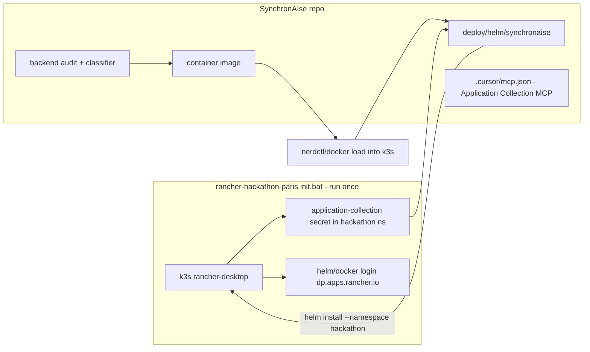

# Deploy SynchronAIse Agents on k3s (via Rancher Desktop bootstrap)

> Plan only. No implementation yet.

## Context & the "link"

SynchronAIse (`C:\Users\salam\Projects\SynchronAIse`) is currently an empty git repo. The roadmap (`SynchronAIse_Roadmap 2.pdf`) defines an audit **backend** (`POST /audit`, `GET /report/{id}`) plus an **LLM/VLM classification engine** — these are the "agents" we deploy.

`rancher-hackathon-paris` is a workstation bootstrap only (no app code). It leaves the machine with:

- Local **k3s** running under kube context `rancher-desktop`
- `helm` + container engine logged in to `dp.apps.rancher.io`
- An `application-collection` image-pull secret in the **`hackathon`** namespace
- An MCP server config for `https://mcp.apps.rancher.io` (Basic auth) in its `mcp.json`

We keep everything inside SynchronAIse and just reuse that contract. Prerequisite for any deploy: the user has already run `init.bat` from the rancher repo once.

## 1. Wire the Application Collection MCP into this repo

- Create `.cursor/mcp.json` mirroring the rancher repo's config (server `application-collection`, `type: http`, `url: https://mcp.apps.rancher.io`, `Authorization: Basic <token>`). This lets Cursor/agents in *this* repo browse & deploy Application Collection charts.
- Because that file carries a live Basic-auth token (and the DoD requires "no API keys in git history"), add `.gitignore` for `.cursor/mcp.json`, `mcp.json`, `.env`.
- Add `.cursor/mcp.example.json` (placeholder token) as the committed template.
- Optional fallback: document `mcp-proxy` usage for MCP clients that dislike Basic auth (proxy on `:3000`).

## 2. Minimal deployable backend (so there is something to containerize)

The repo is empty, so scaffold a thin but real service matching the JSON contract:

- `backend/app/main.py` — FastAPI app exposing `POST /audit` (accepts snapshot + trees, returns the roadmap JSON payload) and `GET /report/{audit_id}` (renders stored payload). Start with an in-memory store and a mocked classifier so it's demo-solid, with a seam for the real Gemini/VLM call.
- `backend/requirements.txt` — `fastapi`, `uvicorn[standard]`, `httpx` (+ `google-generativeai` for the real LLM later).
- `backend/.env.example` — `GEMINI_API_KEY=`, `LLM_PROVIDER=gemini`, plus fallback provider key.

## 3. Containerize

- `backend/Dockerfile` — small Python base, install requirements, run `uvicorn app.main:app --host 0.0.0.0 --port 8080`. Prefer a base image from the Application Collection (`dp.apps.rancher.io`) so the `application-collection` pull secret is exercised end to end.
- Build straight into the k3s image store on Windows/Rancher Desktop: `nerdctl --namespace k8s.io build -t synchronaise-backend:dev backend` (or `docker build` when dockerd is the engine), avoiding a registry push for local dev.

## 4. Helm chart targeting the hackathon namespace

Create `deploy/helm/synchronaise/`:

- `Chart.yaml`
- `values.yaml` — `image.repository=synchronaise-backend`, `image.tag=dev`, `image.pullPolicy=IfNotPresent`, `global.imagePullSecrets={application-collection}`, `service.port=8080`, `env`/`secretRef` for LLM keys.
- `templates/deployment.yaml` — Deployment referencing `.Values.global.imagePullSecrets`, envFrom the LLM secret, readiness/liveness on `/health`.
- `templates/service.yaml` — ClusterIP on 8080.
- `templates/secret.yaml` (optional, opt-in) — for LLM keys, or document creating it via `kubectl create secret generic`.
- Install: `helm install synchronaise ./deploy/helm/synchronaise --namespace hackathon --set global.imagePullSecrets={application-collection}` (matches the exact pattern the rancher README mandates).

## 5. One-command deploy scripts + docs

- `deploy/deploy.ps1` (Windows-first) and `deploy/deploy.sh`: verify `kubectl` context is `rancher-desktop`, verify the `application-collection` secret exists in `hackathon` (fail with a clear message pointing to the rancher repo's `init.bat` if not), build image into k3s, `helm upgrade --install`, then `kubectl port-forward svc/synchronaise 8080` for local access.
- `deploy/README.md`: prerequisites (run rancher `init.bat` first), the deploy steps, how to add supporting Application Collection apps (e.g. a Postgres/Redis chart from `oci://dp.apps.rancher.io/charts/...`) if audit persistence is needed later, and secret handling.

## 6. Update root README

- Add an "Agent deployment" section describing the flow above and the dependency on the rancher-hackathon-paris bootstrap, including the "built during the event" note.

## Notes / decisions

- LLM/VLM keys and the MCP Basic-auth token are kept out of git via `.gitignore` + `.example` files (roadmap DoD).
- We deploy the backend + classifier as a single service first (fastest path to a demo-solid deploy); it can be split into separate Deployments later without changing the chart contract.
- The GitHub Action / react-flow Studio from the roadmap are out of scope for this deployment task; the Action will simply call the deployed `/audit` endpoint.

## Todos

- [ ] **mcp-wire** — Add `.cursor/mcp.json` (gitignored) + `.cursor/mcp.example.json` for the Application Collection MCP server; update `.gitignore`.
- [ ] **backend-scaffold** — Scaffold FastAPI backend (`main.py`, `/audit`, `/report/{id}`, `/health`), `requirements.txt`, `.env.example` with mocked classifier + LLM seam.
- [ ] **dockerfile** — Add `backend/Dockerfile` (Application Collection base image) building the uvicorn service.
- [ ] **helm-chart** — Create `deploy/helm/synchronaise` chart (Chart.yaml, values.yaml, deployment, service, optional secret) using `global.imagePullSecrets={application-collection}` in `hackathon` namespace.
- [ ] **deploy-scripts** — Add `deploy/deploy.ps1` + `deploy.sh` (context/secret checks, build into k3s, helm upgrade --install, port-forward) and `deploy/README.md`.
- [ ] **root-readme** — Add Agent deployment section to root README referencing the rancher-hackathon-paris bootstrap dependency.
