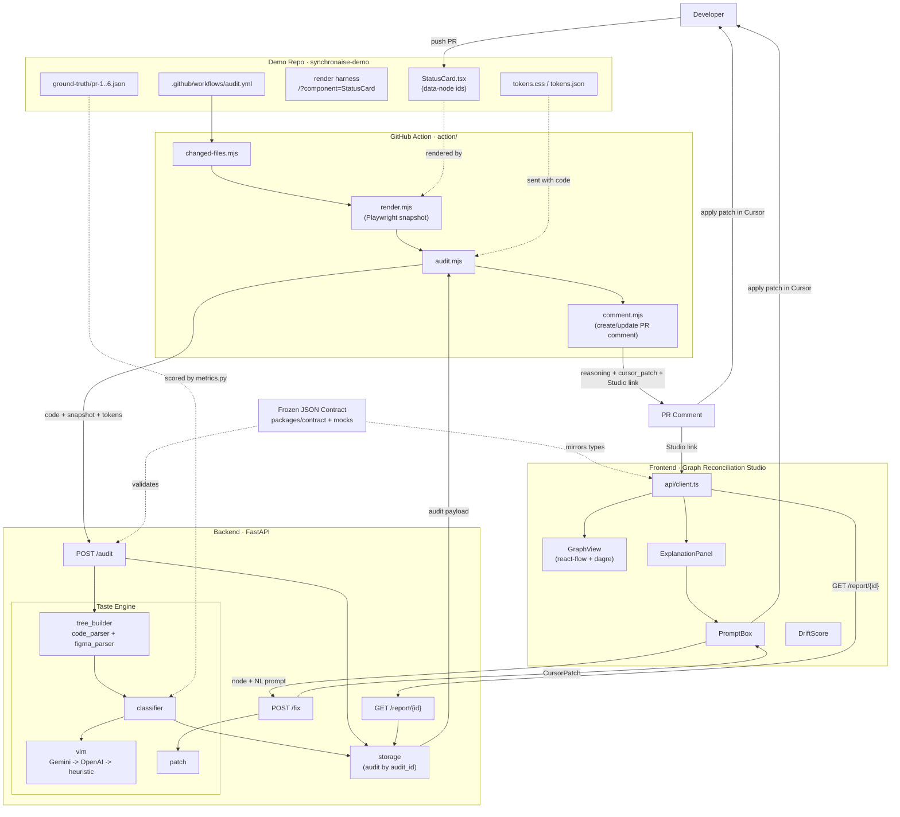

# SynchronAIse - Architecture

This document shows the building blocks of SynchronAIse and how they interact.
For a high-level overview and run instructions, see the [README](../README-2.md).

## The loop

> **push → snapshot → classification → feedback → fix in Cursor → green.**

## Building blocks

## Key interactions

- **The loop:** `push → changed-files → render (Playwright) → /audit → store → PR comment → fix in Cursor → green`.
- **The contract is the spine:** [`packages/contract`](../packages/contract) validates the backend responses and mirrors the frontend TS types, so the Action, Studio, and metrics all read one shape.
- **The Taste Engine degrades gracefully:** `Gemini → OpenAI → deterministic heuristic`, always returning a valid payload so CI and demos are never blocked.
- **Two entry points for fixes:** the PR comment's `cursor_patch`, and the Studio's `PromptBox → /fix` - both produce a patch, neither auto-commits.
- **Ground truth** feeds `metrics.py` to produce the real pitch numbers, separate from the live serving path.

## Component map

| Path | Role | What it is |
| --- | --- | --- |
| [`packages/contract`](../packages/contract) | all | The frozen JSON contract that drives everything. |
| [`backend`](../backend) | R3 + R1 | FastAPI audit service + the Taste Engine. |
| [`action`](../action) | R4 | The reusable GitHub Action (render → audit → comment). |
| [`frontend`](../frontend) | R5 | The Graph Reconciliation Studio (React + react-flow). |
| [`synchronaise-demo`](../synchronaise-demo) | R2 | Hero `StatusCard`, tokens, and the 6 drift PRs. |
