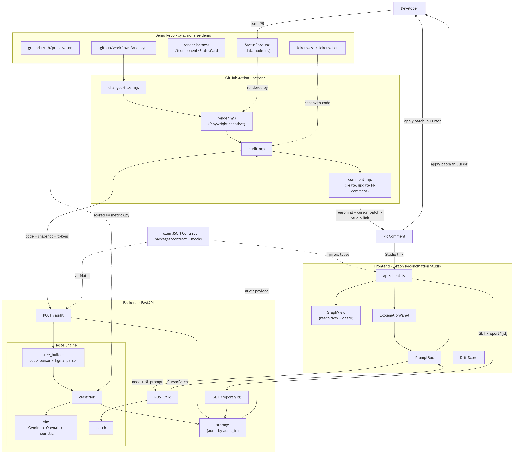

# SynchronAIse - Building Blocks (Team Guide)

This is the "how does it all actually fit together" doc for the team. It explains
every building block, what it is responsible for, and how the pieces talk to each
other. If you only read two sections, read [The JSON Contract](#2-the-json-contract--the-spine)
and [The GitHub Action](#5-the-github-action--r4).



---

## 0. The one-paragraph mental model

A developer opens a PR in the **demo repo** that changes a UI component. A
**GitHub Action** wakes up, renders the changed component in a real browser,
takes a screenshot, and sends the screenshot + the code + the design tokens to
our **backend**. The backend builds two trees (what the design *should* be vs
what the code *actually* is), runs the **Taste Engine** to classify every
difference, and stores the result. The Action turns that result into a **PR
comment** with a ready-to-paste Cursor fix. A link in that comment opens the
**Studio**, a web app that draws the two trees side by side so you can click a
node, read the AI's reasoning, and generate a fix by typing a prompt.

Everything that moves between these pieces is one JSON document: **the contract**.

```
push → render → audit → classify → store → PR comment → (Studio) → fix in Cursor → green
```

---

## 1. Why it is split into these blocks

Five people build in parallel over a weekend. If block A had to wait for block B
to be finished, we'd lose. So we agreed on **one JSON shape (the contract) in the
first hour**, and everyone builds against a *mock* of that shape. The Action, the
Studio, and the metrics script never need the real AI to exist - they just need
the JSON. That is the single most important design decision in the project.

| Block | Folder | Owner | One-line job |
| --- | --- | --- | --- |
| Contract | [`packages/contract`](../packages/contract) | everyone | The agreed JSON shape. |
| Demo repo | [`synchronaise-demo`](../synchronaise-demo) | R2 | The component + tokens + 6 drift PRs to audit. |
| GitHub Action | [`action`](../action) | R4 | Glue: render → call backend → comment. |
| Backend | [`backend`](../backend) | R3 | HTTP service that stores/serves audits. |
| Taste Engine | [`backend/app/services`](../backend/app/services) | R1 | The AI classification brain. |
| Studio | [`frontend`](../frontend) | R5 | The visual, clickable audit UI. |

---

## 2. The JSON Contract — the spine

### What it *is*

The contract is **one JSON document that describes the result of auditing one
component**. It is not code that runs; it is a *data shape* that everyone agrees
on. Think of it as the "API response" that the whole product is built around.

It lives in [`packages/contract`](../packages/contract):

- [`schema.json`](../packages/contract/schema.json) - the formal rules (a
  [JSON Schema](https://json-schema.org/)): which fields exist, their types, which
  are required. This is machine-checkable.
- [`contract.example.json`](../packages/contract/contract.example.json) - a real,
  filled-in example everyone can look at.

The exact same document is copied into two "mock" files so each side can develop
offline:

- [`backend/mocks/audit_mock.json`](../backend/mocks/audit_mock.json) - the backend serves this when there is no AI key.
- [`frontend/src/mocks/audit.json`](../frontend/src/mocks/audit.json) - the Studio renders this when the backend is down.

A test ([`test_contract.py`](../backend/tests/test_contract.py)) fails the build
if those two mocks ever drift apart, so they can never silently diverge.

### Why it matters

- **The Action** builds the PR comment purely from this JSON.
- **The Studio** draws the graphs purely from this JSON.
- **The metrics script** scores accuracy purely from this JSON.
- **R1's AI** only has to *produce* this JSON. Until it can, the mock stands in.

One shape, four consumers. Change the shape → change it in `schema.json` first,
then everyone updates together.

### The shape, field by field

```jsonc
{
  "audit_id": "pr-1-run-1",        // unique id = storage key + Studio route
  "pr_number": 1,                   // which PR this audit is for
  "drift_score": 72,                // 0 = perfectly aligned (green), 100 = max drift
  "screenshot_url": "/artifacts/pr-1-run-1.png",  // the CI-rendered image

  "design_tree": { ... },           // what the component SHOULD be (Figma intent)
  "code_tree":   { ... },           // what the code ACTUALLY produces

  "findings": [ ... ],              // the real problems (design violations)
  "ignored_as_noise": [ ... ],      // changes we deliberately did NOT flag
  "evolution_proposals": [ ... ]    // new intent to reconcile, not revert
}
```

**A tree node** (used by both `design_tree` and `code_tree`) looks like this. The
key idea: the *same* `id` appears in both trees, which lets us line them up and
color them:

```jsonc
{
  "id": "btn-primary",              // STABLE id, identical across both trees
  "label": "Action Button",
  "type": "button",
  "classification": "design_violation",  // aligned | design_violation | technical_noise | intentional_evolution
  "props": { "background": "#ef4444" },   // observed styles
  "children": []
}
```

**A finding** (one row in `findings[]`) is a single detected problem plus its fix:

```jsonc
{
  "type": "token_violation",
  "classification": "design_violation",
  "severity": "high",
  "location": "StatusCard.tsx:14",
  "node_id": "btn-primary",         // <-- links this finding to a node in the trees
  "bbox": [120, 48, 340, 92],       // optional box on the screenshot
  "expected": "var(--color-danger)",
  "actual": "#ef4444",
  "reasoning": "Hex matches token color-danger exactly; hardcoding breaks theming.",
  "cursor_patch": {
    "prompt": "Replace the hardcoded #ef4444 on line 14 with var(--color-danger).",
    "diff": "- color: #ef4444;\n+ color: var(--color-danger);"
  }
}
```

`node_id` is the glue: it connects a *finding* to a *node* in the graph, which is
how the Studio knows to paint that button node red and show its reasoning when
you click it.

### The three classifications (the "Taste")

| Classification | Color | Meaning | Example |
| --- | --- | --- | --- |
| `aligned` | green | Matches the design intent. | Button uses `var(--color-danger)`. |
| `design_violation` | red | A real break; flag it + patch it. | Hardcoded `#ef4444`. |
| `technical_noise` | grey | No visual/semantic impact; ignore *with reasoning*. | A `<div>` wrapper added for scrolling. |
| `intentional_evolution` | amber | New, deliberate intent; reconcile, don't revert. | A brand-new secondary button. |

Getting `technical_noise` right is the judged "taste" - a dumb linter flags the
wrapper div; we explain *why* it's safe to ignore.

The backend enforces this exact shape in code via Pydantic models in
[`backend/app/core/schema.py`](../backend/app/core/schema.py); the Studio mirrors
it in TypeScript in [`frontend/src/types/contract.ts`](../frontend/src/types/contract.ts).

---

## 3. The Demo Repo — R2

[`synchronaise-demo`](../synchronaise-demo) is a **separate repo** (in this
workspace it's a sibling folder). It's what the Action runs *on* and what judges
browse.

- [`src/components/StatusCard.tsx`](../synchronaise-demo/src/components/StatusCard.tsx) -
  the hero component. Every element carries a `data-node="..."` attribute
  (`card`, `icon`, `content`, `title`, `description`, `btn-primary`). Those are
  the **stable node ids** that end up in the trees and let findings point at the
  right node.
- [`src/tokens.css`](../synchronaise-demo/src/tokens.css) + [`src/tokens.json`](../synchronaise-demo/src/tokens.json) -
  the ~20 design tokens (colors, spacing, radius, fonts). The `.css` is what the
  component actually uses; the `.json` is sent to the backend so the AI knows the
  rules.
- [`src/render/status-card-entry.tsx`](../synchronaise-demo/src/render/status-card-entry.tsx)
  + [`src/main.tsx`](../synchronaise-demo/src/main.tsx) - the **render harness**.
  Visiting `/?component=StatusCard` mounts the component alone so the Action can
  screenshot just that element (`[data-node='card']`).
- [`ground-truth/pr-1..6.json`](../synchronaise-demo/ground-truth) - the *correct
  answers* for each of the 6 drift cases. Used by `metrics.py` to measure real
  accuracy (the only numbers we quote in the pitch).
- [`.github/workflows/audit.yml`](../synchronaise-demo/.github/workflows/audit.yml) -
  the trigger that calls our Action (see next section).

The 6 drift cases live as **real open PRs** in this repo, so the repo itself
tells the story when judges click around.

---

## 4. The Backend — R3

[`backend`](../backend) is a small FastAPI HTTP service. Three endpoints matter:

| Endpoint | Who calls it | What it does |
| --- | --- | --- |
| `POST /audit` | the Action | Runs an audit for one component, stores it, returns the contract JSON. |
| `GET /report/{audit_id}` | the Studio | Returns a previously stored audit. |
| `POST /fix` | the Studio's prompt box | Turns a node + a natural-language request into a Cursor patch. |

Plus `GET /healthz` for liveness and `/docs` for auto-generated API docs.

- [`app/api/audit.py`](../backend/app/api/audit.py) - orchestration: build trees →
  classify → store → return.
- [`app/services/storage.py`](../backend/app/services/storage.py) - saves one JSON
  file per `audit_id` under `backend/var/`. Simple and inspectable.
- [`app/core/config.py`](../backend/app/core/config.py) - reads env / `.env`.
  **Key behavior:** if no `GEMINI_API_KEY` / `OPENAI_API_KEY` is set, it runs in
  `MOCK_MODE` and serves the mock. That's why the whole loop works offline.

---

## 5. The GitHub Action — R4

This is usually the part that feels like magic, so here is exactly how the
integration works.

### Two repos, one action

The Action is **defined** in our tool repo at [`action/action.yml`](../action/action.yml).
The demo repo **uses** it from its own workflow. GitHub lets one repo reference an
action published in another repo.

In the demo repo, [`.github/workflows/audit.yml`](../synchronaise-demo/.github/workflows/audit.yml)
is the trigger:

```yaml
on:
  pull_request:                     # run on every PR...
    paths:                          # ...but only if these files changed
      - "src/components/**"
      - "src/tokens.json"
      - "src/tokens.css"

permissions:
  contents: read
  pull-requests: write              # <-- REQUIRED so we can post a comment

jobs:
  audit:
    runs-on: ubuntu-latest
    steps:
      - uses: actions/checkout@v4
        with: { fetch-depth: 0 }    # full history so we can diff base vs head
      - uses: <org>/synchronaise/action@main   # <-- our action, from the tool repo
        with:
          audit-api-url: ${{ secrets.AUDIT_API_URL }}      # where the backend lives
          studio-base-url: ${{ vars.STUDIO_BASE_URL }}     # where the Studio lives
          github-token: ${{ secrets.GITHUB_TOKEN }}        # auto-provided by GitHub
```

Three things to configure in the demo repo's **Settings → Secrets and variables**:

- `AUDIT_API_URL` (secret) - the deployed backend base URL.
- `STUDIO_BASE_URL` (variable) - the deployed Studio base URL, used to build the
  "open in Studio" link in the comment.
- `GITHUB_TOKEN` - you don't create this; GitHub injects it. It just needs
  `pull-requests: write` permission, which the `permissions:` block grants.

Replace `<org>` with your GitHub org/user once the tool repo is pushed.

### What the action does, step by step

[`action/action.yml`](../action/action.yml) is a **composite action** - a named
sequence of shell steps. When the workflow above hits `uses: <org>/synchronaise/action@main`,
GitHub runs these steps in order:

1. **Setup Node** + `npm install` the demo app, then `npm run build`.
2. **Install the action's own deps** (Playwright + wait-on) from
   [`action/package.json`](../action/package.json).
3. **Install Chromium** (pinned version) for deterministic screenshots.
4. **Start the preview server** (`npm run preview` on port 4173) and wait until
   it's reachable - this serves the render harness from block 3.
5. **`changed-files.mjs`** - figures out which component files changed in this PR
   (via `git diff base..head`), so we don't spam audits for unrelated pushes.
6. **`render.mjs`** - opens each changed component in Chromium, screenshots the
   `[data-node='card']` element, and reads the source + tokens.
7. **`audit.mjs`** - POSTs `{ pr_number, code, screenshot_b64, tokens }` to
   `AUDIT_API_URL/audit` and saves the returned contract JSON.
8. **`comment.mjs`** - formats that JSON into markdown and posts it to the PR.

### How the scripts pass data to each other

Each step is a separate Node process, so they can't share variables in memory.
Instead they write small JSON files into a scratch folder `.synchronaise/` in the
workspace (see [`action/scripts/lib.mjs`](../action/scripts/lib.mjs)):

```
changed-files.mjs  →  .synchronaise/changed.json   { files: [...] }
render.mjs         →  .synchronaise/render.json     { components: [{ name, code, screenshot_b64, tokens }] }
audit.mjs          →  .synchronaise/audit.json      { audits: [ <contract JSON>, ... ] }
comment.mjs        →  reads audit.json, posts to GitHub
```

So the pipeline is a chain of files: detect → render → audit → comment.

### The PR comment (create vs update)

[`comment.mjs`](../action/scripts/comment.mjs) embeds a hidden marker
(`<!-- synchronaise-audit -->`) in the comment body. On the next push it searches
the PR's existing comments for that marker: if found, it **edits** that comment
(PATCH); if not, it **creates** one (POST). That's how re-pushing a fix *updates*
the same comment instead of spamming new ones - and why the comment can turn
"green" when the drift is resolved.

### Fails safe

If rendering flakes or the backend is unreachable, each script writes an empty
result and the comment step still posts a "walking skeleton" message rather than
failing the PR. The audit is advisory; it never blocks the merge.

---

## 6. The Taste Engine — R1

Lives inside the backend, in [`backend/app/services`](../backend/app/services).
This is the "brain" that turns raw code + screenshot into classified findings.

```
tree_builder ──► classifier ──► vlm  (Gemini → OpenAI → heuristic)
     ▲                │
code_parser +         └──► produces the contract JSON (findings / noise / evolution)
figma_parser
```

- [`code_parser.py`](../backend/app/services/code_parser.py) - turns the component
  source (TSX) into a `code_tree`, using the `data-node` ids and reading inline
  styles.
- [`figma_parser.py`](../backend/app/services/figma_parser.py) - provides the
  `design_tree` (the canonical intent, hardcoded for the demo).
- [`tree_builder.py`](../backend/app/services/tree_builder.py) - assembles the two
  trees so they share node ids.
- [`classifier.py`](../backend/app/services/classifier.py) - the Taste Engine
  itself. It fills the prompt ([`prompts/classification.md`](../backend/app/prompts/classification.md),
  which includes few-shot examples for all 6 cases) and asks the model to classify
  each difference.
- [`vlm.py`](../backend/app/services/vlm.py) - talks to the model with a **fallback
  chain**: try Gemini → if unavailable, try OpenAI → if no keys at all, use a
  deterministic heuristic. It always returns a valid contract, so CI is never red.
- [`patch.py`](../backend/app/services/patch.py) - builds the `cursor_patch` for a
  finding, and powers `POST /fix`.

---

## 7. The Studio — R5

[`frontend`](../frontend) is a React + Vite app. It is a **pure renderer**: give
it an `audit_id`, it fetches the contract JSON and draws it. It has no business
logic of its own.

- [`api/client.ts`](../frontend/src/api/client.ts) - `getReport(id)` and
  `postFix(...)`. Falls back to the mock JSON if the backend is unreachable.
- [`lib/layout.ts`](../frontend/src/lib/layout.ts) - runs `dagre` to auto-position
  both trees, then draws dashed "mapping" edges between nodes that share an id.
- [`components/GraphView.tsx`](../frontend/src/components/GraphView.tsx) - the
  react-flow canvas: design tree on the left, code tree on the right, nodes
  colored by `classification`.
- [`components/ExplanationPanel.tsx`](../frontend/src/components/ExplanationPanel.tsx) -
  when you click a node, shows expected vs actual, the reasoning, and the patch.
- [`components/PromptBox.tsx`](../frontend/src/components/PromptBox.tsx) - type a
  request ("make this the warning variant"), it calls `POST /fix` and shows the
  generated patch. Never auto-commits.
- [`components/DriftScore.tsx`](../frontend/src/components/DriftScore.tsx) - the
  0-100 score in the top bar; shows "Resolved" (green) at 0.

Open a specific audit at `http://localhost:5173/#/report/<audit_id>`.

---

## 8. End-to-end walkthrough (PR #1)

Follow one real case - the hardcoded `#ef4444` button:

1. **Push.** R2 opens PR #1 changing `StatusCard.tsx` line 14 to
   `background: '#ef4444'`.
2. **Trigger.** The demo repo workflow matches `src/components/**` and starts the
   Action.
3. **Render.** `render.mjs` screenshots the rendered card and reads the code.
4. **Audit.** `audit.mjs` POSTs code + screenshot + tokens to `POST /audit`.
5. **Classify.** The backend builds both trees. The `btn-primary` node's
   background is `#ef4444` in code but `color-danger` in design. `#ef4444` *is*
   the `color-danger` token → **design_violation, high**. A `cursor_patch` is
   generated.
6. **Store + return.** Saved as `pr-1-run-1`; the contract JSON is returned.
7. **Comment.** `comment.mjs` posts a comment: the reasoning, the diff, the
   paste-ready Cursor prompt, and a link to
   `STUDIO_BASE_URL/#/report/pr-1-run-1`.
8. **Studio.** Open the link → two trees, `btn-primary` glowing red. Click it →
   read the reasoning → copy the patch (or type your own in the prompt box).
9. **Fix + green.** Apply the patch in Cursor, push. The Action re-runs, the
   audit finds no violation, `drift_score` → 0, and the *same* comment updates to
   green.

---

## 9. Configuration cheat-sheet

| Where | Name | Purpose |
| --- | --- | --- |
| backend `.env` | `GEMINI_API_KEY` / `OPENAI_API_KEY` | Real AI. Blank = MOCK_MODE (offline). |
| backend `.env` | `STUDIO_BASE_URL` | Used to build report links. |
| backend `.env` | `MOCK_MODE=1` | Force the mock even with keys (safe demos). |
| demo repo secret | `AUDIT_API_URL` | Where the Action sends audits. |
| demo repo variable | `STUDIO_BASE_URL` | Where the comment's "open in Studio" link points. |
| demo repo | `GITHUB_TOKEN` | Auto-provided; needs `pull-requests: write`. |

Never commit real keys - see [`backend/.env.example`](../backend/.env.example).

---

## 10. Glossary

- **Contract** - the agreed JSON shape describing one audit result.
- **Drift** - a difference between the design intent and the code.
- **Taste Engine** - the AI that classifies drift as violation / noise / evolution.
- **Node id** - a stable id (from `data-node`) shared by both trees; links findings to graph nodes.
- **Composite action** - a GitHub Action made of a sequence of shell steps.
- **MOCK_MODE** - backend mode that serves the frozen mock when there's no AI key.
